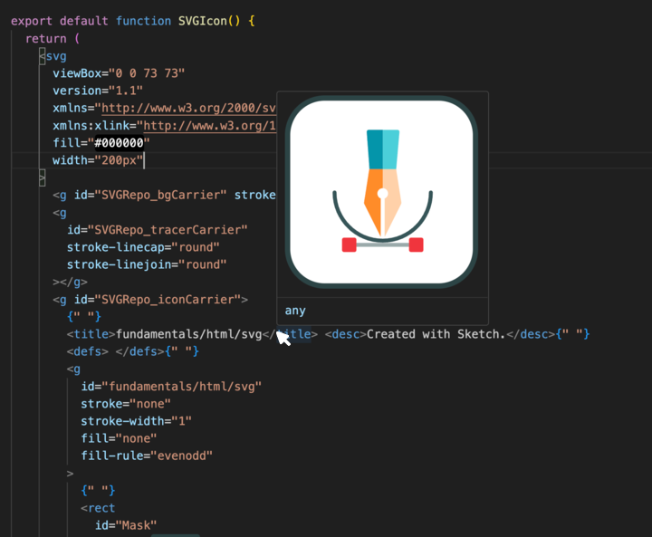

# SVG Preview Extension

The **SVG Preview Extension** is a powerful tool designed to enhance your development experience when working with Scalable Vector Graphics (SVG) files in Visual Studio Code. This extension provides a seamless way to visualize SVGs directly in your editor by displaying live previews on hover.

Whether you're a graphic designer, front-end developer, or simply someone who enjoys working with SVGs, this extension will help you streamline your workflow by eliminating the need to switch between different applications or browsers to check your designs.

Key features include:

- **Instant Preview**: Hover over your SVG code to instantly view a rendered preview, allowing you to quickly validate your designs.
- **Multi-File Support**: The extension supports various file formats, including `.svg`, `.js`, `.jsx`, `.ts`, and `.tsx`, making it versatile for different development environments.
- **Dynamic Rendering**: The extension dynamically handles JSX props and attributes, ensuring that your SVG previews accurately reflect your code.

With the SVG Preview Extension, you can focus more on your design and coding, while leaving the tedious preview process behind.

Preview on Hover

  

